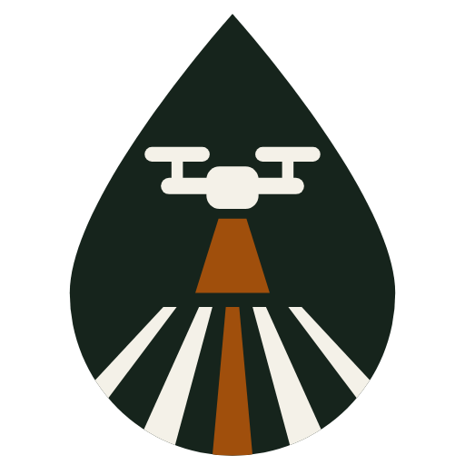
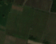

<p align="center"></p>

# Kvali: proof of spray

**Live demo: [khristo19.github.io/kvali](https://khristo19.github.io/kvali/)** (Solana devnet, test money only). To try several farmers and operators, use the [staging version with the account switcher](https://khristo19.github.io/kvali/staging/).

[](https://github.com/Khristo19/kvali/actions/workflows/e2e.yml)

Farmers pay for drone spraying only when the work is proven, and operators get paid on proof, not on the farmer's word. A farmer posts a job and puts the money in escrow. A drone operator does the spraying. Automatic checker bots look at the spray record and, if it holds up, release the payment. If the record is bad (say, the pump was off), it is refused and the reason is shown. Georgia is only the first test field; the plan is fleets and companies with many pilots, then Europe, then Asia. Nothing here uses real money yet.

Verified agricultural drone spraying, settled in USDC on Solana. *Kvali* (კვალი) means "trace" in Georgian: every spray job leaves one you can verify. Working name; may change.

<p align="center"><br><sub>A demo vineyard field in Kakheti, Georgia, from real Sentinel-2 imagery (Copernicus). The spray flights on top of it are simulated.</sub></p>

### What is real and what is simulated

- **Real, on Solana devnet:** the escrow, the operator bond, validator staking and co-signing, challenges, and payout. Every step in the demo is a real devnet transaction with an Explorer link.
- **Simulated:** the drone flight and its sensors (spray records are constructed samples), and the money (test USDC from our own mint).
- **Validator bots:** when the operator sends the spray record, checker bots verify coverage, the litres-per-hectare band and the flow meter against the tank. Two staked validators then co-sign automatically, with no human click. Humans are only needed for certificates, spot checks and challenges.
- **Validator staking:** each demo validator has $500 test USDC staked (minimum stake $100). The program tests prove that an upheld challenge slashes the co-signers to the farmer and that a slashed stake can never sign again. Slashing is switched off in the public demo so the shared demo seats stay usable.
- **E2E:** browser tests (Playwright) run on every deploy against the live and staging demos. The program has 56 tests.

**The pitch.** A farmer posts a spray job and funds a USDC escrow. A certified drone operator accepts it and locks a bond at least equal to the job value. After spraying, independent validators check **liters dispensed per hectare** (not the GPS path) and co-sign; the full record goes to Arweave and only its hash goes on-chain. The operator is paid automatically when the challenge window closes (24 hours for real jobs). Nobody approves: the farmer can only challenge by locking 20% of the job, and a balanced validator panel rules. Fee: 5% (3% Kvali, 2% validators). No token (see [DECISIONS.md](docs/DECISIONS.md)).

**Why Solana.** Cheap, fast USDC settlement for small jobs (a typical job is about $300), program-enforced escrow and bonds with no middleman, and a cheap permanent record: only a 32-byte hash is on-chain, the evidence lives on Arweave.

Built for the Colosseum Crypto World's Fair, Solana track. Submitted solo.

## Try it

| What | Link |
|---|---|
| Live web demo | [khristo19.github.io/kvali](https://khristo19.github.io/kvali/) |
| Staging demo (account switcher for several farmers and operators) | [khristo19.github.io/kvali/staging](https://khristo19.github.io/kvali/staging/) |
| Pitch video | [PITCH VIDEO] |
| Tech demo video | [TECH DEMO VIDEO] |
| Program on Solana devnet | [`2TWg6cMa7bxFa8y7HHoDXZecNJxcbYrUAqwfrg5T8FPK`](https://explorer.solana.com/address/2TWg6cMa7bxFa8y7HHoDXZecNJxcbYrUAqwfrg5T8FPK?cluster=devnet) |
| A real devnet settle transaction (operator paid, fees split) | [`3a34zNsh...dZSG`](https://explorer.solana.com/tx/3a34zNshoxpYuFTUPKJfc81sCiES1ydeNpaT4M1rb5FrG1Sqh2EgWbQZQug7jBnpYnZZtmXvnAsjtiwUrKPZdcSG?cluster=devnet) |
| Proof manifest of that job on Arweave (Irys devnet) | [`4v9YDeg7...GM9E`](https://devnet.irys.xyz/4v9YDeg7L9FHa6z4hdg7H9G9xMXvi39qimG6m2RqGM9E) |

The settle transaction belongs to a $300 test job (devnet test USDC). Its balance check: operator +$585.00, Kvali treasury +$9.00, validator pool +$6.00, exactly as `services/proof/src/settlement.ts` predicts. The manifest's SHA-256 (`1f6eac36...400741`) is the proof hash that was submitted on-chain in the same job. Irys devnet data is temporary (deleted after about 60 days). All spray data is **simulated**, and flagged `"simulated": true` in the manifest.

More transactions (post, accept, submit proof, and a rejected pump-off proof) are in [deploy/demo-run-latest.json](deploy/demo-run-latest.json).

## What works today vs what is simulated

| Piece | Status |
|---|---|
| Anchor program (escrow, bond, 2-of-3 proof co-sign, challenge, panel ruling, fees, calibration certificates) | **Live on devnet.** Deployed 8 Oct 2026. Not on mainnet, not audited. |
| Program tests | **56 tests pass** in LiteSVM (in-process Solana runtime, runs the real compiled program). No network used. |
| Devnet demo script | **Works.** Runs an honest job to payout, and a pump-off job that the program rejects (`RateOutOfBand`). A farmer-challenge scenario exists in the script but has not been run live. |
| Proof service and CLI | **Works.** Telemetry record to verdict (coverage, rate band, tank cross-check), manifest, canonical SHA-256. 42 tests pass. |
| Manifest on Arweave | **Works on Irys devnet** (one upload, link above). Not encrypted yet; not mainnet Arweave. |
| Expo app (farmer, operator, validator, job story, field map) | **Runs on Solana devnet (web).** Every step of a job is a real devnet transaction with an Explorer link, signed with public **demo devnet keys** (test funds only; anyone can use them). Balances and job state are read back from the chain. A "Simulated" mode remains as a fallback. Wallet sign-in (Privy, Phantom) is not wired yet. |
| Wallets: Privy embedded wallet, Phantom | **Not wired yet.** The sign-in buttons are placeholders. |
| Field map and satellite check | **Works in the app (web).** Farmer draws the field on satellite tiles (Esri) and hectares are computed from the outline; the outline's SHA-256 goes with the job. Three real vineyard outlines from OpenStreetMap. Real Sentinel-2 crop health (NDVI) and images from Copernicus via `scripts/satellite-fetch.mjs`. Validators see the flight path over the field, but the tracks are **simulated**. NDVI shows vigour, not proof of spray. Cadastral lookup is not available yet. |
| Real drone data | **None yet.** All records are realistic samples for a 17 ha field in Kakheti, Georgia. No real farmer, operator or drone is involved. |
| USDC | **Devnet test USDC** (our own mint), not real money. |
| Validators | **Test keys.** Three keypairs we control stand in for the three validator seats. |

## How it works

```
 Farmer                Operator              Validators (2 of 3)         Program (Solana)
   |  post job + USDC     |                         |                          |
   |--------------------------------------------------------------------------> Posted (escrow)
   |                      | accept + bond (>= job)  |                          |
   |                      |  (needs valid cert)     |                          | Accepted
   |                      | spray, export record    |                          |
   |                      |-- manifest -> Arweave --|                          |
   |                      |        recompute verdict, co-sign                  |
   |                      |------------ submit_proof (2 signatures) ---------> ProofSubmitted
   |                      |                                  program re-checks coverage + L/ha
   |  [challenge window: 24 h real, 60 s on the demo deployment]
   |  no challenge ---------------------------------------- settle (anyone) --> Settled
   |  challenge: lock 20% ----------> panel rules (2 of 3) ------------------> farmer or operator paid
```

- **Verify volume, not the flight path.** A drone can fly the pattern with the pump off and leave the same GPS track. So the check uses liters dispensed per hectare against the allowed band, coverage of at least 95% of the posted area (and at most 105%), a flow-meter versus tank-weight cross-check in the proof service, random spray-card spot checks in the field (~10% of jobs, planned), and the farmer's right to challenge.
- **Validators.** Three seats chosen for balanced interests: operator side, farmer side, neutral. Two of three must co-sign a proof. Kvali holds no seat. The program re-checks the numbers itself, so colluding validators cannot pass impossible values. A validator who is the job's farmer or operator does not count toward the threshold.
- **Challenge.** The farmer locks 20% of the job amount and commits to an evidence hash. A 2-of-3 panel rules. The loser pays a 10% panel fee; the honest side pays nothing for the dispute. The bond goes to the counterparty, not a treasury, so there is nothing to collude for.
- **Fees.** 5% of the job amount, taken at payout: 3% Kvali, 2% validators (1% data validators, 1% spot-check pool). The operator's bond is returned in full on a good outcome. If the operator never submits a valid proof, `reclaim_expired` gives the farmer the escrow plus the operator's bond after the spray deadline (no fees).
- **Operator bond.** At least equal to the job value; one active job at a time.
- **Calibration certificates.** Before accepting jobs, an operator and drone pair must pass a calibration test (flow-meter error at most 5% against a weighed tank, a practical check). A validator records it on-chain with `issue_certificate`. A 2-of-3 panel can revoke it. **A revoked certificate is final:** that operator and drone pair can never be certified again; the way back is a new drone with its own certificate. An expired (not revoked) certificate can be renewed. Standard: [CALIBRATION.md](docs/CALIBRATION.md).
- **Configurable window.** The challenge window is a `Config` setting (60 s to 7 days). Real jobs use 24 h. The devnet demo deployment is set to 60 s so a full job fits in a video.

## Trust assumptions and known limitations

We would rather you read these here than discover them.

- **Validator seats are permissioned in v1.** The three seats are set by an admin key (Kvali). The program limits what they can do (they can only send vault funds to the job's farmer or operator), but you are trusting three parties to be honest and balanced. Validators can now stake USDC on chain (`stake_validator`, cooldown-gated `withdraw_stake`); when the admin sets a minimum stake, only staked validators can co-sign proofs, and a challenge panel ruling against a proof slashes every staked co-signer to the farmer. Slashing happens only through that ruling, never by admin decision. On the demo deployment the minimum stake is $100 and each demo validator has $500 test USDC staked, so only staked validators co-sign. Slashing is proven by program tests but disabled in the public demo so the shared seats stay usable. The panel itself is the same three seats and is not staked against its own vote. Permissionless joining and random assignment are the v2 plan, not built. The admin key must move to a multisig before mainnet.
- **No on-chain tank cross-check.** The flow-meter versus tank-weight check runs in the proof service and in validators' software. The program checks only liters per hectare and coverage from the submitted numbers; it cannot tell whether the tank reading was honest. Drone telemetry itself is still trusted (DJI export). A sealed signing device on the drone is the long-term fix.
- **A validator can also be an operator.** `issue_certificate` only checks that the signer is in the validator set, so a validator who runs a drone can certify their own. Proof and challenge signing skip conflicted keys; certification does not. A test documents this.
- **Single-validator renew.** Any one validator can renew a non-revoked certificate and change its recorded meter error. Revocation wins over renewal, but renewal is not a panel decision.
- **No maximum certificate expiry.** `valid_until` has no upper bound.
- **Vault accounts are not closed.** After a job ends the empty vault token account stays open and its rent stays locked.
- **Test money and keys.** Devnet test USDC, a deploy wallet that is also the upgrade authority (the program is upgradeable on purpose while we build; the plan is a Squads multisig with a timelock and a verified build before mainnet, and freezing it after an audit, see [DECISIONS.md](docs/DECISIONS.md) D16), and validator keys we control. The program has not been audited.
- **LiteSVM is not a real validator.** The 56 tests run the compiled program in-process; they do not replace a localnet or mainnet-beta run.
- **Simulated data.** No real spray job has happened yet. The pump-off, half-field and tank-mismatch cases are constructed samples.
- **Privacy.** The sample manifest on Arweave is public and unencrypted. Encrypted records (farmer-held key) and private payments via Hinkal are planned.

## Repo layout

| Path | What |
|---|---|
| `programs/kvali/` | Anchor program (`src/lib.rs`): escrow, bond, validator co-sign, challenge, fees, calibration certificates |
| `tests/` | LiteSVM tests for the compiled program (`kvali.ts`, `harness.ts`) |
| `scripts/` | `devnet-demo.ts` (devnet job runner), `devnet-setup.ts`, `demo-proof.mjs` (helper for the demo) |
| `services/proof/` | Proof service and CLI: verdict, manifest, settlement maths, Irys upload; sample records in `samples/` |
| `app/` | Expo (React Native) app for web, Android and iOS; simulated engine in `src/engine/` |
| `deploy/` | Public devnet addresses and results of the latest demo run and Arweave upload |
| `docs/` | Specs, decisions, scripts, task records (see below) |
| `sim/` | Pixel-art "how it works" simulation (spec only, last step) |
| `research/` | Original vetting report |

Key docs: [ARCHITECTURE.md](docs/ARCHITECTURE.md), [ONCHAIN_SPEC.md](docs/ONCHAIN_SPEC.md), [PROOF_SPEC.md](docs/PROOF_SPEC.md), [DECISIONS.md](docs/DECISIONS.md), [VALIDATORS.md](docs/VALIDATORS.md), [CALIBRATION.md](docs/CALIBRATION.md), [WHY.md](docs/WHY.md), [DEMO_SCRIPT.md](docs/DEMO_SCRIPT.md). Also [REGULATORY.md](docs/REGULATORY.md) and [FIELD_VALIDATION.md](docs/FIELD_VALIDATION.md) for the real-world plan in Georgia.

## How to run

**Toolchain.** Node 22.18 or newer (the proof service runs TypeScript directly). To rebuild the program: Anchor 0.31.1 and Solana CLI 2.1.0 (pinned in `Anchor.toml`), plus Rust. Install Solana, Rust and Anchor with the [Solana quick install](https://solana.com/docs/intro/installation).

```bash
# 1. Program tests (local, in-process, never touches a network)
npm install
anchor build            # only if you changed the program; tests use target/deploy/kvali.so
npm test                # 56 tests
```

Do not use plain `anchor test`: `Anchor.toml` points at devnet. Use `npm test`.

```bash
# 2. Devnet demo (devnet only; the script refuses any other cluster, never use mainnet)
npm run demo:devnet -- --dry-run     # print the plan, send nothing
npm run demo:devnet                  # honest job + pump-off job on the live program
npm run demo:devnet -- --challenge   # also a farmer challenge scenario
```

A real (non-dry) run needs a devnet wallet with a little SOL and the deployer's keys, which are not in this repo. Without them, use `--dry-run` and the recorded run in `deploy/demo-run-latest.json`.

```bash
# 3. Proof CLI: spray record -> verdict -> manifest -> SHA-256
cd services/proof
npm test
node src/cli.ts --job samples/job-17ha.json --record samples/record-honest.json
node src/cli.ts --job samples/job-17ha.json --record samples/record-pump-off.json   # FAIL, exit 1
```

```bash
# 4. App (devnet by default on web; toggle "Simulated" in the banner)
cd app && npm install && npx expo start --web
```

In the app, open "Job story" and tap "Run the full demo" for a complete job with a live challenge-window countdown.

## Roadmap

1. Privy embedded wallet for farmers (email or Google sign-in, no seed phrase) and Phantom for operators and validators.
2. Switch the app from the simulated engine to the real devnet program.
3. Sentinel-2 satellite field check and a field map in the app.
4. Encrypted records and private payments with Hinkal.
5. A real field job in Kakheti, Georgia, with a DJI Agras drone and real validators.
6. Later: permissionless staked validators, a signing device on the drone.

## License and credits

License: [TBD]

Design thinking draws on a16z crypto research on DePIN incentives (Wuollet, "Why DePIN matters, and how to make it work"; Milionis et al., "Manipulated signals in DePIN protocols"), cited in [DECISIONS.md](docs/DECISIONS.md). Built with Anchor, LiteSVM, Expo, Irys and Arweave. Hackathon: Colosseum Crypto World's Fair.
