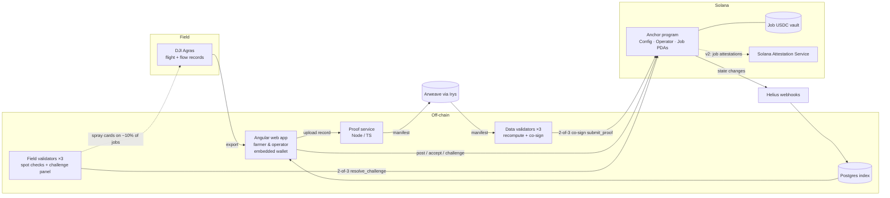

# Architecture

## Components

| Component | Responsibility | Stack |
|---|---|---|
| Anchor program | Escrow, bond, state machine, liters/ha and coverage checks, payout | Anchor 0.31, Token-2022-compatible interface |
| Proof service | Parse telemetry, compute verdict, build and upload manifest, collect validator signatures |
| Validator node | Download manifest, recompute verdict (`verdict.ts`), sign if it passes | Same TypeScript, run by each data validator | Node 22 / TypeScript, @coral-xyz/anchor, Irys |
| App | Field, jobs, proof and weather record, challenge with 20% bond | Expo (React Native: web, Android, iOS); embedded wallet (Privy) for farmers, Phantom for others |
| Indexer | Job lists and history for the app | Helius webhooks → Postgres |
| Storage | Full proof manifest (telemetry summary, photos, verdict) | Arweave via Irys |

## Trust boundaries (say these out loud in the demo)

| Who | Trusted to | Limited by |
|---|---|---|
| Data validators (2 of 3) | Vouch that the proof record is consistent | Program re-checks the numbers; field spot checks; farmer can challenge |
| Field validators (2 of 3) | Rule on challenges; run spot checks | Balanced seats (operator side, farmer side, neutral); can only send vault funds to the job's farmer or operator |
| Kvali (admin key) | Set the validator set; receive 3% | Holds no validator seat; admin moves to a multisig before mainnet |
| Farmer | Witness: may challenge | Must lock 20%; loses it if wrong; public challenge record |
| Operator | Spray and submit a true record | Bond ≥ job value; one active job at a time |
| DJI telemetry | Report volume accurately | Tank-weight cross-check, liters/ha band, spot checks |

Path from v1 to decentralised: permissioned 3-seat validator set → permissionless validators staking USDC, randomly assigned, never in their own region → a signing device on each drone (DECISIONS.md D9, D11).
